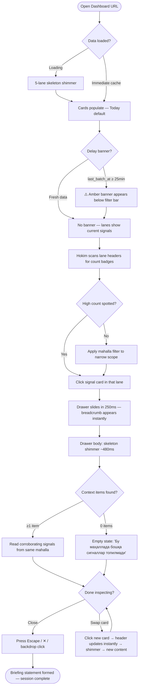
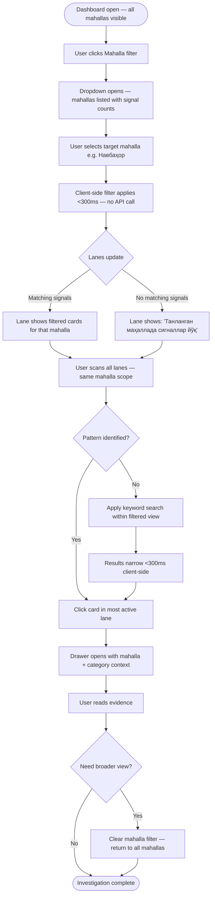
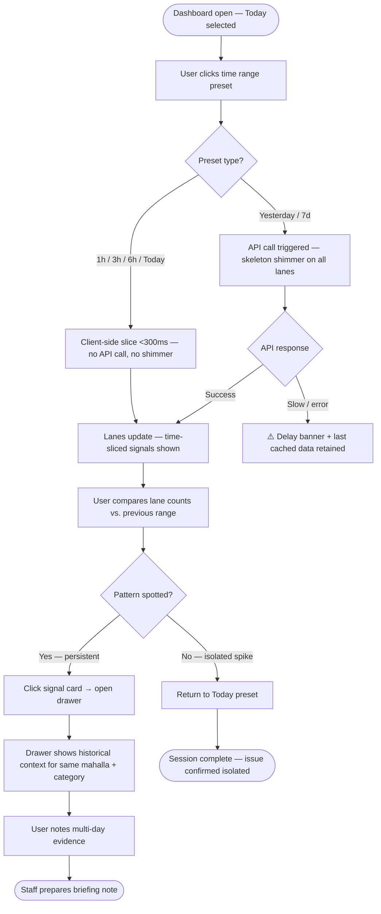

# UX Design Specification mahalla-ovozi

**Author:** Zubaydulla
**Date:** 2026-05-20

---

## Executive Summary

### Project Vision
Mahalla Ovozi (Voice of the Mahalla) is a private GovTech situational awareness dashboard that extracts civic signals from noisy Telegram group chats and structures them so a busy, non-technical district governor (*tuman hokimi*) can review what residents are reporting in a matter of seconds. It acts as a passive monitoring dashboard and does not manage issue tracking or resident-facing interactions.

### Target Users
*   **Primary User (Tuman Hokimi):** A non-technical, high-level decision-maker who values quick scanning and evidence validation. Uses a large office monitor (1920x1080) in light mode. Requires immediate clarity on who reported what, where, and when.
    *   *Sender Visibility Policy:* Display the Telegram display name snapshot (e.g., *Али Валиев*) by default so the hokim has enough evidence to identify who wrote the message. If unavailable, fall back to the Telegram username (e.g., `@ali_valiyev`), and default to *Резидент* (Resident) if both are missing.
*   **Secondary User (Authorized Staff):** Monitors the dashboard on behalf of the hokim, prepares summaries, and filters by specific terms or mahallas.
*   **Technical Admin (Operator):** Monitors system health, checks bot connectivity, and reviews pre-filter discard logs.

### Key Design Challenges
*   **Information Density & Layout Complexity:** Presenting 5 independently scrolling lanes and a right-side drawer overlay simultaneously on a single desktop view without creating visual clutter or high cognitive load.
*   **Cross-Cutting Prioritization:** Helping the user understand that the *Ҳокимга тегишли* (Hokim-related) lane is a priority view flag rather than a service category (a message can exist in *Газ* and *Ҳокимга тегишли* simultaneously).
*   **System Status Transparency:** Representing empty states (no reports) and pipeline delays (e.g., "Signals may be delayed" when AI batches lag) in a clear, non-technical manner.
*   **Localization Consistency:** Enforcing clean Uzbek Cyrillic terminology for all primary lanes and tone badges:
    *   *Lanes:* *Ҳокимга тегишли* (Hokim-related), *Сув* (Water), *Электр* (Electricity), *Газ* (Gas), *Чиқинди* (Waste).
    *   *Tones:* *Шикоят* (Complaint), *Эълон* (Announcement), *Ташаккур* (Praise), *Савол* (Question).

### Design Opportunities
*   **Contextual Evidence Mapping:** Providing instant neighborhood context through a right-side drawer that loads related signals (same mahalla + same category + time window) automatically when a card is selected. Clicking a different card instantly refreshes the drawer.
*   **Premium Civic Aesthetics:** Building a modern, light-mode, Telegram-familiar design using clean typography (e.g., Inter or Outfit) and subtle micro-interactions to create a state-of-the-art administrative tool.

---

## Core User Experience

### Defining Experience
The core loop of Mahalla Ovozi is a three-second scan followed by a single-click investigation:
1. **Scan:** The governor glances at the five category lanes, assessing signal counts and tone patterns.
2. **Select:** The governor clicks an active signal card in any lane.
3. **Inspect:** The right-side context drawer opens instantly, presenting the localized evidence stream for that signal.

The product succeeds when this loop requires no training and produces no confusion.

### Platform Strategy
- **Target Device:** Desktop and large office monitors (1920×1080 primary; 1366×768 minimum functional fallback). Mobile is explicitly out of scope for MVP.
- **Input Method:** Mouse and keyboard. No touch interactions required.
- **Network Pattern:** Single-Page Application (SPA) communicating via a REST API. The UI performs a background 60-second polling refresh to keep data current without disrupting the user's scroll position, active filters, or open drawer state.

### Drawer Behavior
The context drawer is a **fixed-width overlay panel** (~380px at 1920×1080; ~340px at 1366×768) that slides in from the right edge. The five lane columns do **not** compress or reflow when the drawer opens — the drawer overlays the rightmost lane(s) as a separate surface layer.

- **Backdrop:** A very light semi-transparent backdrop (`rgba(0,0,0,0.08)`) softens the partially covered lanes without hiding them.
- **Close triggers:** Explicit ✕ button in the drawer header, clicking the backdrop, or pressing Escape.
- **Hokim-related lane context rule:** The drawer's context query is determined by **the lane the user clicked from**, not the signal's stored service category.

| Lane Clicked From | Drawer Query |
|---|---|
| *Газ* | `category = gas AND mahalla_id = X AND time_range` |
| *Ҳокимга тегишли* | `hokim_related = true AND mahalla_id = X AND time_range` |

**Drawer breadcrumb in the Ҳокимга тегишли lane:**
When the clicked card originated from the *Ҳокимга тегишли* lane, the breadcrumb shows the signal's **actual service category**, not the lane name:
- Example: `Газ · Навбаҳор маҳалласи · 10:42` *(not `Ҳокимга тегишли · ...`)*

Rationale: The hokim opened the drawer from the priority lane but needs to know *which service* is affected. The lane name adds no evidence value once the drawer is open — the category does.

For all other lanes the breadcrumb shows the lane name as normal:
- Example: `Сув · Олмазор маҳалласи · 09:15`

This ensures the user always knows which signal is active and which service it concerns, even after scrolling its card out of view.

### Effortless Interactions

**Instant Context Drawer Swapping:**
When the drawer is already open and the user clicks a different signal card in any lane:
1. The drawer **header breadcrumb updates immediately** to the new card's lane + mahalla.
2. The drawer **content area** shows a skeleton shimmer (3–4 ghost card rows) while the context API call resolves.
3. When content loads (target: within 500ms), the skeleton is replaced by real signal cards.
4. The new card receives the active highlight; the previous card returns to its default state.

**Persistent Visual Anchoring:**
The active signal card receives:
- A 3px solid left-border accent in the category's color
- A very subtle category-tinted background fill (~5% opacity)

This state persists until the drawer is closed, giving the user a clear visual anchor even while interacting with other lanes.

**Client-Side Fluidity:**
Filtering by mahalla, switching time range presets, and searching by keyword operate on already-fetched client data, returning updated lane results within 300ms.

### Critical Success Moments

**The "60-Second Briefing" (Primary Success):**
The governor opens the app, spots a cluster of *Шикоят* (Complaint) tone badges in the *Электр* lane from Олмазор маҳалласи, clicks one card, and reads three corroborating citizen statements in the drawer — all within 60 seconds and without reading a single raw Telegram chat.

**Delay Grace Mode (Make-or-Break Trust Moment):**
When the AI classifier batch is running slow, the UI never shows an error modal or a blank dashboard. Instead, a non-intrusive amber status banner appears below the filter bar:

> *"⚠️ Сигналлар янгиланмаяпти — охирги янгиланиш 11:20"*
> ("Signals not updating — last update at 11:20")

| State | Trigger | Behavior |
|---|---|---|
| Normal | `last_batch_at < 25 min ago` | No banner shown |
| Delayed | `last_batch_at ≥ 25 min ago` (detected on 60s poll) | Amber banner below filter bar |
| Recovered | Next poll returns fresh `last_batch_at` | Banner auto-clears, no user action needed |

The last cached batch remains fully visible and scrollable during the delay.

### Empty Lane States
Each lane independently handles the absence of signals. When a lane has zero results for the current filter state:
- The lane's sticky header remains visible with a count of **0**
- The lane body displays a centered muted empty-state block (soft icon + short message)
- Messages adapt to context:

| Cause | Message (Uzbek Cyrillic) |
|---|---|
| No signals today | *Бугун сигналлар йўқ* |
| Mahalla filter returns zero | *Танланган маҳаллада сигналлар йўқ* |
| Search returns no matches | *Қидирув натижалари топилмади* |

- Empty states use **muted gray** visuals — no error colors.
- **Loading state** (initial data fetch) is distinct: a skeleton shimmer fills card positions. Empty state only appears after a fetch completes with zero results.

### Experience Principles

**1. Glanceability Above All**
Content is structured for rapid visual triage. Lane signal counts, category-color left-border accents, tone badges, and timestamp + sender lines must allow a busy user to assess district health in under 60 seconds.

**2. Context Without Disruption**
Detail inspection must never disorient the user. The drawer slides in as an overlay, keeping all five lanes visible and independently scrollable behind it.

**3. Telegram-Informed, Dashboard-First**
We borrow from Telegram: trust in message authenticity, chronological ordering, and sender+timestamp anchoring. We do not copy: chat bubbles, alternating left/right layout, or dark-mode neon aesthetics. Signal cards are clean horizontal rows with category-colored left-border accents — optimized for top-to-bottom scanning within a fixed-width column.

**4. Zero Ambiguous States**
Every element must communicate its interactivity clearly through visual design. No element that looks interactive may be inert; no element that is inert may look clickable.

| Element Type | Cursor | Hover | Example |
|---|---|---|---|
| Interactive (filters, search, card, drawer close) | `pointer` | Visible active/lift state | Time range selector, signal card |
| Decorative label (tone badge, hokim flag icon) | `default` | None | *Шикоят* pill, hokim indicator |

---

## Desired Emotional Response

### Primary Emotional Goals

The primary emotional goal for Mahalla Ovozi is **Calm Authority**.

The hokim should feel like a commander with a clear view of the battlefield — not anxious, not overwhelmed, and not confused. Every design decision should reinforce this feeling: structured data, predictable interactions, and clean visual hierarchy that communicates "this system is working and you are in control."

The secondary emotional goal is **Confident Trust**. The hokim must believe the signals he sees are real, sourced from real residents, and that nothing important is being hidden or fabricated. This trust is built through raw message text visibility, explicit sender references, and a transparent processing status indicator — not through polished AI summaries that hide the source.

### Emotional Journey Mapping

| Moment | Desired Emotion | Design Response |
|---|---|---|
| First load / Login | Calm orientation | Clean, uncluttered dashboard; Today's signals default; no onboarding clutter |
| Scanning lanes | Focused efficiency | High-density but visually organized cards; category-color accents guide the eye instantly |
| Spotting a pattern (many complaints in one lane) | Alert awareness (not anxiety) | Count badge on lane header turns visually prominent; tone badges cluster visually |
| Clicking a card / Opening drawer | Confident investigation | Smooth slide-in animation; breadcrumb grounds the user; context loads quickly |
| Reading drawer context | Informed clarity | Clean typography; raw Uzbek text presented as-is; timestamps anchor evidence in reality |
| Applying a filter (mahalla, time range) | Effortless control | Instant response (<300ms); no full-page reload; filter state persists visibly |
| Seeing the delay banner | Mild concern, not panic | Amber (not red); plain Uzbek Cyrillic text; no error codes; cached data still visible |
| Returning after break | Familiarity and reliability | Layout unchanged; last used filters remembered; last active drawer state cleared cleanly |

### Micro-Emotions

| Micro-Emotion | Target State | Risk to Avoid |
|---|---|---|
| Confidence ↔ Confusion | **Confidence** — user always knows where they are and what the data means | Avoid: ambiguous lane states, unclear drawer context, unlabeled empty screens |
| Trust ↔ Skepticism | **Trust** — signals feel sourced from real residents, not AI summaries | Avoid: hiding raw text, showing only AI-generated short labels without source context |
| Efficiency ↔ Friction | **Efficiency** — filtering and searching feel instant and zero-overhead | Avoid: loading spinners on filter changes, full-page refreshes, multi-step flows |
| Alert ↔ Anxiety | **Alert** — pattern recognition feels like a useful signal, not an alarm | Avoid: red error colors for normal delay states, high-contrast warning visuals for low-severity events |
| Reliability ↔ Uncertainty | **Reliability** — the system feels like it is always on and trustworthy | Avoid: silent failures, blank states with no explanation, unexplained data gaps |

### Design Implications

**Calm Authority → Restrained Color Palette**
The UI must avoid high-saturation alarm colors in primary UI chrome. Category colors are used as accents (left borders, count badges) not as dominant fills. The overall background is near-white or very light warm gray, not clinical stark white.

**Confident Trust → Raw Text Always Visible**
Signal cards must always show the raw Uzbek/Russian message snippet — never replace it with only the AI-generated short label. The short label is a complement to the raw text, not a substitute. This design rule is non-negotiable for trust.

**Efficient Control → No Loading Spinners on Client Operations**
Filtering, searching, and time range changes operate entirely on client-cached data. No spinner should appear for these operations. Only the initial page load and drawer context fetches show loading states (skeleton shimmers, not spinners).

**Alert Without Anxiety → Severity-Calibrated Visual Language**
The design system must use a strict severity ladder for status indicators:
- 🟢 Green: System healthy (not shown as a persistent badge — absence of warning = healthy)
- 🟡 Amber: Non-critical delay or low-severity event (delay banner, stale data)
- 🔴 Red: Reserved for genuine critical failures only (not used in MVP for any hokim-facing element)

**Reliability → Predictable Layout Contract**
The layout must never shift unexpectedly. The five lanes always occupy the same positions. The filter bar is always visible. The drawer always opens from the right at the same width. Users should be able to develop reliable spatial memory for this dashboard within their first session.

### Emotional Design Principles

**1. Authority, Not Alarm**
The dashboard should feel like a professional briefing system, not an emergency operations center. High-urgency visual language (red fills, flashing indicators, modal alerts) is actively harmful to this product. Leadership tools must project calm confidence.

**2. Evidence, Not Abstraction**
Every AI-classified signal is only as trustworthy as the raw text behind it. Design must always preserve access to the original citizen message, keeping the hokim anchored in real evidence rather than machine summaries.

**3. Reliability Through Consistency**
Emotional trust in a tool is built through repetition and consistency. The layout, the colors, the interaction patterns, and the language must never change unexpectedly between sessions. Predictability is a feature, not a constraint.

**4. Quiet Delight over Showmanship**
Micro-interactions (drawer slide, skeleton shimmer, card highlight transition) should add polish and smoothness without drawing attention to themselves. The goal is that users feel the UI is "responsive" and "smooth" without consciously noticing the animations. If an animation is noticed, it is too prominent.


## UX Pattern Analysis & Inspiration

### Inspiring Products Analysis

- **Telegram (Communication Baseline):**
  - *Strengths:* High readability of mixed-language text (Uzbek Cyrillic, Latin, Russian), familiar card metadata placement (sender name top-left, timestamp top-right), and visual scanning speed.
  - *Application:* Adopt the card metadata layout structure, ensuring the information hierarchy is instantly familiar to any Uzbek official who uses Telegram daily.

- **Linear (SaaS Administration):**
  - *Strengths:* Right-side context drawers that overlay content cleanly, high-contrast selected item states, and responsive skeleton loaders instead of spinners.
  - *Application:* Slide-in overlay context drawer that does not compress the main workspace, maintaining speed and a focused reading view.

- **Trello / Kanban Systems (Information Architecture):**
  - *Strengths:* Simultaneous scanning of multiple categories across independent scrolling columns.
  - *Application:* Five independent chronological streams in a fixed-column grid, allowing the hokim to monitor all utility categories side-by-side without switching views.

### Transferable UX Patterns

- **Layout:** Multi-lane horizontal grid. Each lane is an independent vertical scroll container. The top of each lane features a sticky header with category name, category-color accent, and real-time signal count.
- **Interaction:** Right-side overlay drawer slide-in. Swapping active cards replaces drawer contents via a skeleton shimmer transition, maintaining the full page layout without reflow.
- **Visual:** Compact, high-density cards with a standardized 3-line text clamp on raw message snippets. The full message body is revealed only inside the context drawer, keeping lanes clean and scannable.

### Anti-Patterns to Avoid

- **The Chat Bubble Layout:** Designing lanes to look like actual Telegram chats with left/right bubble alternation. Dashboard cards must be uniform list elements for fast vertical scanning — not conversation threads.
- **Aggregate Analytics Overload:** Replacing raw messages with heavy charts, aggregate percentages, or AI-summarized categories. The hokim needs raw, localized resident signals, not data abstractions that hide direct community evidence.
- **Clickable-Looking Decorative Badges:** Tone badges (*Шикоят*, *Эълон*, etc.) styled with hover states, pointer cursors, or button-like borders. They are flat pill labels only — the visual contract must make their inert nature immediately clear.
- **Interactive Tone Filtering via Badges:** Clicking tone badges is disabled for the MVP pilot to preserve fixed scope. Filtering is handled exclusively by the dedicated filter bar controls.
- **Conversational Thread UI:** No reply chains, thread expansions, or direct messaging interfaces within the dashboard lanes — it is a passive monitoring tool, not a citizen communication channel.

### Design Inspiration Strategy

**Adopt:**
- *Linear's Context Drawer Pattern:* Overlay slide-in from the right with ✕ close button, Escape key dismiss, and backdrop tap close.
- *Kanban Column Architecture:* Five fixed-width columns with independent vertical scroll, sticky lane headers, and persistent column identity.

**Adapt:**
- *Telegram's Card Metadata Layout:* Sender name + mahalla + timestamp line structure, simplified into a high-density border-accented dashboard card row (not a chat bubble).

**Avoid:**
- *Conversational UI Patterns:* No reply indicators, no message grouping by sender, no thread nesting.
- *Heavy Analytics Dashboards:* No pie charts, bar graphs, or KPI summary tiles in the MVP — signals are the primary content unit.

---

## Design System Foundation

### Design System Choice

**Selected: Ant Design v5 (AntD) with a custom design token theme.**

Ant Design v5 is chosen as the component foundation for Mahalla Ovozi. It provides a complete, production-tested library of administrative UI components under a CSS-in-JS theming system (ConfigProvider + design tokens), which integrates cleanly with the React + Vite + TypeScript stack without introducing Tailwind CSS or a conflicting stylesheet layer.

### Rationale for Selection

- **Desktop-first component library:** AntD components are designed and optimized for dense data presentation on large monitors — aligning precisely with the 1920×1080 primary target.
- **Covers all required MVP components out-of-the-box:** Drawer, Card, Tag (tone badges), Badge (lane signal counts), Skeleton, Alert (delay banner), Select, DatePicker, Input.Search — all with full TypeScript typings.
- **Design token theming without external CSS conflicts:** AntD v5's ConfigProvider token system allows full palette, typography, and border-radius overrides at the theme root — no Tailwind, no class conflicts, no specificity battles.
- **Uzbek Cyrillic rendering:** AntD is designed for multi-script environments (Chinese, Japanese, Korean) and renders Uzbek Cyrillic cleanly with any specified `fontFamily` token.
- **Solo-developer efficiency:** A single engineer can build and ship the full MVP dashboard using standard AntD primitives, reserving custom CSS only for the five-lane grid layout and category-color left-border accents.

### Implementation Approach

- **Theme Root:** A single `<ConfigProvider theme={mahallaTtheme}>` wrapper at the app root applies all token overrides globally.
- **Custom-built components (2 only):**
  1. `<LaneColumn>` — the five-lane horizontal grid container with independent virtual scroll.
  2. `<SignalCard>` — the individual signal card with category-colored left-border accent (built on AntD `Card` with custom token overrides).
- **Standard AntD components used as-is:**
  - `Drawer` → Context drawer overlay
  - `Tag` → Tone badges (*Шикоят*, *Эълон*, etc.)
  - `Badge` → Lane signal count
  - `Skeleton` → Loading states (initial load + drawer swap shimmer)
  - `Alert` → Delay status banner (`type: "warning"`)
  - `Select` + `DatePicker` → Mahalla and time-range filter controls
  - `Input.Search` → Keyword search

### Customization Strategy

The AntD theme token overrides establish our specific design language:

| Token | Value | Purpose |
|---|---|---|
| `colorPrimary` | Neutral indigo (finalized Step 8) | Primary interactive elements |
| `colorBgContainer` | `#FAFAF9` (warm off-white) | Dashboard background — not clinical white |
| `fontFamily` | `'Inter', 'Outfit', sans-serif` | Typography baseline for Uzbek Cyrillic readability |
| `borderRadius` | `8px` | Consistent component rounding |
| `colorBorder` | `#E5E7EB` | Subtle structural borders |

**Category color tokens** (applied as left-border accents and count badge colors — exact hex values finalized in Step 8):

| Category | Token Name | Color Direction |
|---|---|---|
| *Ҳокимга тегишли* | `categoryHokim` | Deep burgundy / maroon |
| *Сув* | `categorySuv` | Sky blue |
| *Электр* | `categoryElektr` | Amber / gold |
| *Газ* | `categoryGaz` | Slate teal |
| *Чиқинди* | `categoryChiqindi` | Earthy olive |

---

## Defining Core Experience

### Defining Experience Statement

**"See what residents of any mahalla are saying about any utility issue — in one click, in under 60 seconds."**

This is the defining experience of Mahalla Ovozi. Unlike reading raw Telegram chats or waiting for staff briefings, the hokim opens the dashboard and immediately understands district health through classified, structured signal cards. The defining interaction — clicking a signal card and seeing corroborating neighborhood evidence in the drawer — is the moment the product proves its value.

### User Mental Model

**Current solving approach (before Mahalla Ovozi):**
The hokim or his staff manually read raw Telegram supergroups, taking 30–60 minutes to scan each group looking for patterns. Signal extraction is informal, inconsistent, and depends entirely on staff capacity. There is no classification, no categorization, and no evidence aggregation across mahallas.

**Mental model the user brings:**
- "A signal card is like a Telegram message, but already sorted and labeled."
- "The lane column is like a topic channel — all electricity complaints live in one place."
- "The drawer is like opening a message thread to see what else people in that area said."

**Where users are likely to get confused:**
1. The *Ҳокимга тегишли* lane vs. service category lanes (resolved by explicit lane header design).
2. Why some cards appear in two lanes simultaneously (resolved by drawer breadcrumb showing the active lane lens).
3. Why signals are from 20 minutes ago and not real-time (resolved by delay banner and a persistent "last updated" timestamp in the filter bar).

**What makes existing approaches inadequate:**
- Raw Telegram groups require reading hundreds of unrelated messages to find 3–4 civic signals.
- Forwarding messages to staff for summaries adds time lag and potential for filtering bias.
- No existing tool classifies or aggregates Uzbek-language civic complaints automatically.

### Success Criteria

The core interaction is successful when:
1. The hokim finds a relevant signal card without scrolling more than one visible screen height.
2. The drawer opens within 500ms and shows at least one corroborating evidence item from the same mahalla.
3. The hokim can form a briefing statement (who, what, where) from reading the drawer without opening Telegram.
4. The entire scan → click → read loop completes in under 60 seconds from dashboard open.
5. The hokim does not ask "is this working?" — the system's status is always self-evident.

### Pattern Analysis: Novel vs. Established

The core experience uses **established patterns combined in a novel context**. No novel interaction patterns require user education — every mechanic maps to a familiar mental model.

| Pattern | Source | Novel Application |
|---|---|---|
| Kanban column with cards | Trello, Linear | Chronological monitoring feed, not task management |
| Right-side overlay drawer | Linear, Figma | Evidence aggregation from a civic AI data pipeline |
| Category-colored left-border accent | Analytics dashboards | Public utility classification in Uzbek Cyrillic |
| Skeleton shimmer loading state | Modern SaaS | 20-minute AI batch pipeline with 60s polling cycle |

### Experience Mechanics

**Initiation:**
- User opens the dashboard URL in the browser (no install required).
- Dashboard loads in the "Today" time range by default with all five lanes visible.
- Skeleton shimmers fill each lane during initial data fetch, then resolve to real signal cards.

**Interaction:**
- User visually scans lanes top-to-bottom. Count badges on lane headers draw attention to active lanes.
- User clicks a `<SignalCard>` in any lane.
- The context drawer slides in from the right edge (CSS transition: 250ms ease-out).
- The clicked card receives an immediate active highlight (left border 4px solid + background tint).

**Feedback:**
- Drawer header breadcrumb immediately shows: `[Lane] · [Mahalla] · [Timestamp]`.
- Drawer content area shows a 3-row skeleton shimmer while the context API call resolves.
- On load, drawer body shows 3–8 corroborating signal cards from the same context query.
- If context query returns zero items: *"Бу маҳаллада бошқа сигналлар топилмади"* (No other signals found in this mahalla).

**Completion:**
- The user reads drawer evidence and forms a judgment.
- The user closes the drawer via ✕ button, Escape key, or backdrop click.
- The previously active card returns to its default state.
- All five lane scroll positions are preserved exactly as the user left them.
- The user may immediately click another card (drawer swaps) or apply a filter to narrow scope.

---

## Visual Design Foundation

### Color System

The palette is built around the "Calm Authority" emotional goal: restrained, professional, and trustworthy — with deliberate category accent colors that provide instant visual orientation without creating alarm.

#### Base Palette (AntD ConfigProvider tokens)

| Role | Token | Hex | Usage |
|---|---|---|---|
| Background | `colorBgLayout` | `#F5F4F2` | App-level outer background |
| Container | `colorBgContainer` | `#FAFAF9` | Lane column backgrounds, drawer background |
| Surface elevated | `colorBgElevated` | `#FFFFFF` | Signal cards, modals |
| Border subtle | `colorBorder` | `#E8E5E1` | Lane dividers, card borders |
| Border stronger | `colorBorderSecondary` | `#D1CEC9` | Filter bar dividers, drawer header border |
| Text primary | `colorText` | `#1A1714` | Main signal text, headings |
| Text secondary | `colorTextSecondary` | `#6B6560` | Sender name, mahalla label, timestamps |
| Text placeholder | `colorTextPlaceholder` | `#A09990` | Empty state messages, placeholder text |
| Primary action | `colorPrimary` | `#4F46A8` | Focused buttons, active filter chips, links |
| Warning (delay) | `colorWarning` | `#D97706` | Delay banner background accent |
| Success | `colorSuccess` | `#16A34A` | System healthy indicator (not shown persistently) |
| Error | `colorError` | `#DC2626` | Reserved — not used in any MVP hokim-facing element |

#### Category Color Tokens (Left-border accents + count badge colors)

Deliberately muted mid-tones that read clearly against the `#FAFAF9` container without triggering alarm responses.

| Category | Token | Hex | Character |
|---|---|---|---|
| *Ҳокимга тегишли* | `categoryHokim` | `#7C2D56` | Deep raspberry — authority / priority |
| *Сув* | `categorySuv` | `#1D6FA4` | Slate blue — water |
| *Электр* | `categoryElektr` | `#B45309` | Warm amber — electricity, energy |
| *Газ* | `categoryGaz` | `#1A7060` | Teal green — pipe / flow systems |
| *Чиқинди* | `categoryChiqindi` | `#5C6B2E` | Earthy olive — waste, environment |

#### Tone Badge Colors (flat pill labels, muted fills)

| Tone | Background | Text |
|---|---|---|
| *Шикоят* (Complaint) | `#FEE2E2` | `#991B1B` |
| *Савол* (Question) | `#E0F2FE` | `#075985` |
| *Эълон* (Announcement) | `#F3F4F6` | `#374151` |
| *Ташаккур* (Praise) | `#DCFCE7` | `#166534` |

#### Severity Ladder (Status indicators only)

| State | Color | Usage |
|---|---|---|
| Healthy | No badge | Absence of warning = healthy |
| Delayed | `#D97706` amber | Delay banner text + left border |
| Critical | `#DC2626` red | **Not used in any MVP hokim-facing element** |

### Typography System

**Primary font: Inter** — selected for superior Uzbek Cyrillic Unicode coverage (U+0400–U+04FF) and excellent dense-information legibility at 11–14px on high-DPI desktop monitors.

**Loading:** Google Fonts `@import` with `display=swap` and subset `latin,latin-ext,cyrillic` to prevent layout shift and reduce bundle size.

#### Type Scale

| Role | Size | Weight | Line Height | Usage |
|---|---|---|---|---|
| Lane header title | 13px | 600 | 1.4 | Category name in sticky lane header |
| Lane count badge | 12px | 700 | 1 | Signal count number |
| Card sender name | 13px | 600 | 1.4 | Telegram display name |
| Card mahalla label | 12px | 400 | 1.4 | Mahalla name below sender |
| Card timestamp | 11px | 400 | 1.4 | Relative time (e.g., "10 дақ. олдин") |
| Card signal text | 13px | 400 | 1.5 | Raw message snippet (3-line clamp) |
| Tone badge label | 11px | 500 | 1 | *Шикоят*, *Савол*, etc. |
| Drawer heading | 14px | 600 | 1.4 | Breadcrumb: Lane · Mahalla · Time |
| Drawer context card | 13px | 400 | 1.5 | Corroborating signal text |
| Filter label | 13px | 500 | 1.4 | Filter bar control labels |
| Empty state message | 13px | 400 | 1.6 | *Бугун сигналлар йўқ* |
| Delay banner | 13px | 500 | 1.4 | *⚠️ Сигналлар янгиланмаяпти* |

### Spacing & Layout Foundation

**Base unit: 4px.** All spacing values are multiples of 4px.

#### Key Spacing Values

| Token | Value | Usage |
|---|---|---|
| `space-1` | 4px | Minimum gap between inline elements |
| `space-2` | 8px | Card internal padding (tight) |
| `space-3` | 12px | Tone badge padding, filter chip padding |
| `space-4` | 16px | Card standard padding, lane header padding |
| `space-5` | 20px | Gap between cards within a lane |
| `space-6` | 24px | Lane column horizontal padding |

#### Layout Grid

| Zone | Spec |
|---|---|
| App outer shell | `100vw`, `min-width: 1024px` |
| Filter bar | Full width, fixed height `56px`, `position: sticky; top: 0` |
| Lane grid container | `100%` width, `height: calc(100vh - 56px)`, `overflow: hidden` |
| Individual lane column | `flex: 1`, `min-width: 200px`, `overflow-y: auto` (virtualized scroll) |
| Lane column gap | `1px` rendered as `colorBorder` divider |
| Context drawer | Fixed overlay: `380px` (≥1440px viewport), `340px` (≥1024px viewport) |
| Drawer backdrop | Full viewport, `rgba(15, 12, 10, 0.06)` |

#### Signal Card Anatomy

```
┌──────────────────────────────────────────────────┐
│ [4px category-color left border]                 │
│  ┌──────────────────────────────────────────┐   │
│  │ [Sender Name]          [Timestamp]        │   │  ← 13px/600 + 11px/400
│  │ [Mahalla Name]                            │   │  ← 12px/400, colorTextSecondary
│  │                                            │   │
│  │ [Raw message text, 3-line clamp...]        │   │  ← 13px/400, 1.5 line-height
│  │                                            │   │
│  │ [● Tone Badge]  [★ if hokim-related]       │   │  ← 11px/500 flat pill
│  └──────────────────────────────────────────┘   │
└──────────────────────────────────────────────────┘
Padding: 12px 16px. Background: #FFFFFF. Border-radius: 8px. Box-shadow: 0 1px 3px rgba(0,0,0,0.06).
Active: left-border → 4px solid categoryColor; background → categoryColor at 5% opacity.
```

### Accessibility Considerations

- **Contrast ratios:** All text/background pairs meet WCAG 2.1 AA minimum (4.5:1 normal text, 3:1 large text).
  - `#1A1714` on `#FAFAF9`: 18.2:1 ✅
  - `#6B6560` on `#FAFAF9`: 5.9:1 ✅
  - `#4F46A8` on `#FFFFFF`: 7.2:1 ✅
  - All tone badge foreground/background pairs verified ≥4.5:1 ✅
- **Focus indicators:** AntD's default focus ring preserved and enhanced (2px offset, `colorPrimary` outline) — not removed for aesthetics.
- **Keyboard navigation:** Drawer closable via Escape; filter controls fully tab-navigable; signal cards assigned `tabIndex=0`.
- **Font size floor:** No UI text falls below 11px to maintain legibility at standard 96dpi desktop scaling.
- **No color-only information:** Category identity is communicated by both color (left-border) and text label (lane header name + card mahalla label) simultaneously.

---

## Design Direction Decision

### Design Directions Explored

Three interactive design directions were generated and evaluated in [`ux-design-directions.html`](./_bmad-output/planning-artifacts/ux-design-directions.html):

| Direction | Density | Filter Bar | Lane Headers | Card Border |
|---|---|---|---|---|
| **A · Compact Scan** | Maximum (3-line clamp, 7px gap) | Light, `#FFFFFF` | Subtle top-border accent (3px) | 4px left-border |
| **B · Airy Editorial** | Relaxed (2-line clamp, 10px gap) | Medium, `colorBgLayout` | Subtle top-border accent (3px) | 4px left-border |
| **C · Bold Headers** | Maximum | Dark, `#1A1714` | Fully colored category background | 3px left-border |

### Chosen Direction

**Direction A — Compact Scan** is selected as the implementation baseline.

### Design Rationale

- **Glanceability is the primary principle.** Direction A's maximum density (3-line text clamp, 7px card gap, 56px filter bar) most directly serves the 60-second scan loop established in Step 7. More white space (Direction B) reduces the number of signals visible without scrolling, undermining the core value proposition.
- **Restrained lane headers reinforce Calm Authority.** Direction A's subtle 3px top-border accent on each lane header avoids the high-saturation alarm feeling that Direction C's fully colored headers produce. Category identity is communicated through color + text label together — not color alone.
- **Light filter bar preserves visual hierarchy.** The `#FFFFFF` filter bar creates a clear horizontal anchor at the top without competing with the lane content below. Direction C's dark filter bar creates an unnaturally high-contrast seam that draws the eye upward rather than into the lanes.
- **Compact density matches the real user context.** The hokim reviews this dashboard during brief morning briefings. Compact density maximizes information visible per glance, which is appropriate for a monitoring tool used by an experienced daily user.

### Implementation Approach

- Start with Direction A card dimensions, gap sizes, and filter bar as the production baseline.
- The context drawer (fully functional in the HTML prototype) confirms the 250ms slide-in + skeleton shimmer + breadcrumb header pattern is correct.
- The delay banner (amber, non-blocking, below filter bar) is confirmed as the correct placement from the prototype.
- Tone badge legibility at 10–11px on muted pill backgrounds is confirmed as readable at desktop viewing distance.

### Elements Noted from Other Directions

- From **Direction B:** The 13px card sender name (vs 12px in Direction A) is slightly more legible. Consider bumping sender name to 13px in the final implementation.
- From **Direction C:** The fully colored lane headers are visually striking and could be considered for a future "high-contrast mode" or print-summary view — not for the default MVP.

---

## User Journey Flows

### Journey 1: Daily Morning Briefing (Primary — Hokim)

**Goal:** Hokim opens the dashboard at the start of the day, identifies the most pressing district issue, and forms an evidence-based briefing statement in under 60 seconds.

**Entry point:** Dashboard URL opens to default “Today” time range. All 5 lanes populate via skeleton shimmer → real cards.



**Optimization notes:**
- Steps A→D must complete within 2 seconds (NFR1) to avoid perceived lag.
- The delay banner must never block lane content — informational only, no action required.
- Card swap (step S) must feel instant: header breadcrumb updates before the API call resolves.

---

### Journey 2: Mahalla Deep-Dive (Focused Investigation — Hokim or Staff)

**Goal:** User narrows the dashboard to a specific mahalla after receiving a verbal report, and reviews all active signals across all categories simultaneously.

**Entry point:** Dashboard already open. User interacts with the Mahalla filter control.



**Optimization notes:**
- Mahalla dropdown must show signal counts per mahalla (e.g., `Навбаҳор маҳалласи (9)`) to help the user prioritize.
- Filter state persists across drawer open/close cycles. It resets only on explicit “Clear” action.
- Clearing the filter must restore the pre-filter scroll positions in all lanes.

---

### Journey 3: Time-Range Shift Investigation (Pattern Discovery — Staff)

**Goal:** Staff member suspects a recurring issue. They shift the time range to check whether a category has a new spike or an ongoing multi-day pattern.

**Entry point:** Dashboard open with “Today” active. User clicks a time range preset.



**Optimization notes:**
- Preset ranges (1h, 3h, 6h, Today) are client-side only — no shimmer, no API call.
- Only “Yesterday” and “7d” require a new API fetch with skeleton shimmer.
- The active time preset must always show a visually distinct active chip state.
- Custom date range picker (max 7-day window) uses AntD `DatePicker.RangePicker` inline below the filter bar — not a modal.

---

### Journey Patterns

**Pattern 1 — Filter → Scan → Click → Read (The Core Loop)**
Every journey reduces to this 4-step rhythm. All design decisions must optimize this sequence. Any interaction that adds steps between Filter and Read is a regression.

**Pattern 2 — Client-Side Operations are Always Instant (<300ms)**
All filter changes on already-fetched data must never show loading states. The boundary between client-side (instant) and server-side (API call → shimmer) operations must be architecturally enforced.

**Pattern 3 — State Persistence Across Interactions**
No user action resets state the user did not explicitly change. Active filter persists across drawer cycles. Scroll positions persist across filter changes. Only explicit “Clear” actions reset filters.

**Pattern 4 — Graceful Degradation on Latency**
Every API-dependent step has a defined degraded state: skeleton shimmer (initial load / context fetch), amber delay banner (batch pipeline lag). No step results in a blank screen or a red error modal.

### Flow Optimization Principles

1. **Minimize steps to evidence.** Hokim must reach corroborating evidence in ≤3 interactions from dashboard open: (1) optional filter, (2) card click, (3) drawer read.
2. **Feedback at every transition.** Skeleton shimmers confirm the system heard the click. Instant breadcrumbs confirm the drawer is responding. Active filter chips confirm scope.
3. **Error paths are calm, not alarming.** All degraded states use amber or gray — never red — and always retain the last successfully loaded data.
4. **Swapping is cheaper than reopening.** Clicking a different card while the drawer is open costs one API call — no close → click → reopen cycle required.

---

## Component Strategy

### Design System Components (AntD v5 — Used As-Is)

| Component | AntD v5 | Usage in Mahalla Ovozi |
|---|---|---|
| `Drawer` | ✅ | Context evidence drawer overlay |
| `Tag` | ✅ | Tone badges (*Шикоят*, *Савол*, etc.) |
| `Badge` | ✅ | Lane signal count on lane headers |
| `Skeleton` | ✅ | Initial load shimmer + drawer swap shimmer |
| `Alert` | ✅ | Delay status banner (`type: "warning"`) |
| `Select` | ✅ | Mahalla filter dropdown |
| `DatePicker.RangePicker` | ✅ | Custom date range picker (max 7d) |
| `Input.Search` | ✅ | Keyword search box in filter bar |
| `Tooltip` | ✅ | Long mahalla name truncation tooltip |
| `ConfigProvider` | ✅ | Global theme token overrides |
| `Empty` | ✅ | Base for empty state blocks (customized) |

### Custom Components

Only 2 components require custom implementation — they have no AntD equivalent:

#### `<LaneGrid>`

**Purpose:** The five-column horizontal layout container. Manages the full-viewport lane grid with independent virtual scroll per column, lane-level keyboard navigation, and layout stability under the drawer overlay.

**Anatomy:**
```
<LaneGrid>                        ← flex row, 100vw, calc(100vh - 56px)
  <LaneColumn category="hokim">  ← flex:1, overflow-y:auto, virtualized
  <LaneColumn category="suv">
  <LaneColumn category="elektr">
  <LaneColumn category="gaz">
  <LaneColumn category="chiqindi">
</LaneGrid>
```

**Props:**
```typescript
interface LaneGridProps {
  signals: SignalsByCategory;       // pre-grouped by category (see duplication rule below)
  activeSignalId: string | null;    // highlights the active card
  onCardClick: (signal: Signal) => void;
}
```

**Hokim-related duplication rule (PRD FR — intentional):**
A signal with `hokim_related = true` must appear in **both** the `hokim` lane and its original service category lane. The `SignalsByCategory` grouping produced by `<DashboardPage>` must implement this explicitly:

```typescript
type LaneKey = 'hokim' | 'suv' | 'elektr' | 'gaz' | 'chiqindi';
type SignalsByCategory = Record<LaneKey, Signal[]>;

// Grouping logic (pseudocode):
for (signal of allSignals) {
  lanes[signal.category].push(signal);          // always in service lane
  if (signal.hokim_related) {
    lanes['hokim'].push(signal);                // also in hokim lane
  }
}
```

The same `Signal` object is referenced (not copied) in both lanes. The `<SignalCard>` rendered in each lane receives the lane's own `categoryColor` prop, so the card visually adapts per lane (see `<SignalCard>` spec below).

**Count badge rule:** The lane header count badge reflects the number of cards in that lane after grouping — a duplicated signal increments the count in *both* the Hokim lane and its service lane. This is intentional: the hokim sees the full priority count in the Hokim lane without the service lane counts being suppressed.

**States:**

| State | Behavior |
|---|---|
| Loading | All 5 columns show `<Skeleton active>` rows (3 rows each) |
| Populated | Cards rendered via virtual scroll (`@tanstack/react-virtual`) |
| Drawer open | LaneGrid does not reflow; drawer overlays from the right edge |
| Filtered | Columns independently rerender with filtered `signals` prop |

**Virtual scroll requirement:** Lanes must use virtual scroll when a lane exceeds 50 cards to prevent DOM bloat and maintain scroll performance on 7d range fetches.

**Accessibility:**
- Each `<LaneColumn>` has `role="feed"` and `aria-label` equal to the category Uzbek Cyrillic name.
- Individual `<SignalCard>` elements have `tabIndex={0}` and `aria-label` derived from sender + mahalla + timestamp.

---

#### `<SignalCard>`

**Purpose:** The atomic unit of the dashboard. Displays one classified signal with metadata, tone badge, and active/default visual states. Triggers the drawer on click.

**Anatomy:**
```
<SignalCard>
  ├── left border (4px, categoryColor)           ← always the SERVICE category color
  ├── card-meta row
  │    ├── sender name (13px/600)
  │    └── timestamp (11px/400, right-aligned)
  ├── mahalla label (12px/400, colorTextSecondary)
  ├── message text (13px/400, 3-line clamp)
  └── card-footer
       ├── ToneBadge (AntD Tag, non-interactive)
       ├── CaptionBadge (📷 icon, visible only if text_source = 'caption')
       └── HokimStar (★ icon, visible only if hokim_related=true)
```

**Color rule when rendered inside the Ҳокимга тегишли lane:**
The `categoryColor` prop passed to `<SignalCard>` is **always the signal's original service category color**, even when the card is rendered inside the Hokim lane. The Hokim lane has no color of its own for card borders.

| Signal | Rendered in | `categoryColor` passed |
|---|---|---|
| `category=gaz, hokim_related=true` | Hokim lane | Gas yellow `#854D0E bg` |
| `category=gaz, hokim_related=true` | Газ lane | Gas yellow `#854D0E bg` |
| `category=suv, hokim_related=false` | Сув lane | Water blue |

Rationale: the hokim must instantly know *which service* a Hokim-lane card concerns without opening the drawer. Color is the fastest signal — it must never be overridden by lane membership.

**Props:**
```typescript
interface SignalCardProps {
  signal: Signal;
  isActive: boolean;               // controls highlight state
  categoryColor: string;           // hex from category token map
  onClick: (signal: Signal) => void;
}
```

**States:**

| State | Visual Change |
|---|---|
| Default | `border-left: 4px solid categoryColor`, `background: #FFFFFF`, `box-shadow: 0 1px 3px rgba(0,0,0,0.06)` |
| Hover | `box-shadow: 0 2px 8px rgba(0,0,0,0.10)`, `cursor: pointer` |
| Active | `background: categoryColor at 5% opacity`, `box-shadow: 0 2px 10px rgba(0,0,0,0.12)` |
| Skeleton | Replaced by `<Skeleton active paragraph={{ rows: 3 }} />` |

**Accessibility:**
- `tabIndex={0}` for keyboard access.
- `role="article"` with `aria-label="{senderName}, {mahalla}, {relativeTime}"`.
- `onKeyDown` handler: Enter and Space trigger `onClick`.

**Content rules:**
- Message text is **always** raw Uzbek/Russian text — never replaced by the AI short label alone.
- Text clamped to 3 lines. Full text shown only inside the context drawer.
- Sender fallback chain: Display Name → `@username` → *Резидент*.
- Timestamp: relative (*10 дақ. олдин*) for signals ≤24h old; absolute (`HH:MM`) for older signals.
- **Caption source indicator:** If `signal.text_source === 'caption'`, the `CaptionBadge` (📷 icon, 11px, `colorTextPlaceholder`, `aria-label="Rasm tavsifi"`) is shown in the card footer. It communicates that the text came from a photo caption, not a plain text message. It is non-interactive and carries no color — it must not compete visually with the ToneBadge. The full text is still displayed as normal; only the source provenance changes.

### Component Implementation Strategy

- **Custom components use AntD tokens only** — no ad-hoc color literals. All colors reference `useToken()` from `antd/es/theme`.
- **`<SignalCard>` is a pure presentational component** — receives all data via props, maintains no internal state, delegates all actions to parent handlers.
- **`<LaneGrid>` owns layout** — manages active card state, virtual scroll instances, and communicates card selection to `<DashboardPage>`.
- **`<DashboardPage>` owns data** — fetches signals, manages filter state, controls drawer open/close, passes filtered+grouped data to `<LaneGrid>`.

### Implementation Roadmap

**Phase 1 — Core MVP (required for pilot launch):**
- `<LaneGrid>` + `<LaneColumn>` with virtual scroll (`@tanstack/react-virtual`)
- `<SignalCard>` with default / hover / active states
- AntD `Drawer` configured as context panel with breadcrumb header
- AntD `Alert` as amber delay banner
- AntD `Select` as mahalla filter dropdown
- Time range preset chips (custom styled `<button>` group using AntD tokens)

**Phase 2 — Quality & Completeness (required before user testing):**
- AntD `Input.Search` keyword filter with client-side debounce (300ms)
- AntD `DatePicker.RangePicker` for custom date range (7d max enforced)
- Empty state per lane using AntD `Empty` with Uzbek Cyrillic description
- Skeleton shimmer on all async boundaries (lane initial load + drawer context fetch)

**Phase 3 — Polish (post-pilot feedback):**
- Mahalla signal counts in `Select` dropdown options
- Relative timestamp localization (*дақ. олдин*, *соат олдин*, *кеча*)
- Keyboard lane navigation (Arrow Left/Right to shift active lane focus)
- Print-friendly `<SignalCard>` CSS for potential export view

---

## UX Consistency Patterns

### Interaction & Cursor Contract

Every element must communicate its interactivity through visual design alone — no tooltip labels required.

| Element | Cursor | Hover Effect | Focus Ring |
|---|---|---|---|
| `<SignalCard>` | `pointer` | Box-shadow lift + bg tint | `colorPrimary` outline 2px |
| Filter chip | `pointer` | Border → `colorPrimary` | `colorPrimary` outline 2px |
| Mahalla `Select` | `pointer` | AntD default | AntD default |
| Drawer close (✕) | `pointer` | Background → `colorBorder` | `colorPrimary` outline 2px |
| Tone badge (*Шикоят*, etc.) | `default` | None | None |
| Hokim star (★) | `default` | None | None |
| Lane header | `default` | None | None |
| Drawer backdrop | `default` | None | n/a |

**Rule:** No decorative element may respond to click. No clickable element may look decorative.

### Loading & Skeleton States

| Context | Component | Skeleton Structure | When |
|---|---|---|---|
| Initial page load | All 5 `<LaneColumn>` | 3 skeleton card rows each (90px) | Until first API response |
| Drawer context fetch | `Drawer` body | 3 skeleton rows (90px, 75px, 85px) | Until context API response |
| Time range Yesterday/7d | All 5 `<LaneColumn>` | Same as initial load | Until API response |
| Mahalla filter change | None | No loading state | Client-side <300ms |
| Keyword search | None | No loading state | Client-side <300ms |

**Rule:** Skeleton shimmers appear only on API-boundary transitions. Client-side operations never show any loading indicator.

### Empty State Patterns

| Context | Icon | Message | Action |
|---|---|---|---|
| Lane — no signals today | 🗂 (muted) | *Бугун сигналлар йўқ* | None |
| Lane — no mahalla match | ○ (muted) | *Танланган маҳаллада сигналлар йўқ* | None |
| Lane — keyword no match | 🔍 (muted) | *Қидирув натижаси топилмади* | Clear search hint |
| Drawer — no context signals | ○ (muted) | *Бу маҳаллада бошқа сигналлар топилмади* | None |

**Visual spec:** Icon at 28px, 35% opacity. Message at 12px, `colorTextPlaceholder`. Vertically centered in available container height. No buttons or CTAs — empty states are informational, not prompts to action.

### Feedback & Status Patterns

| Feedback Type | Component | Color | Position | Dismissible |
|---|---|---|---|---|
| Pipeline delay (>20min) | AntD `Alert type="warning"` | Amber `#D97706` | Fixed below filter bar, above lane grid | No — auto-clears when data refreshes |
| Mahalla filter active | Chip active state | `colorPrimary` border + `#EEF0FD` bg | Filter bar | Yes — click chip or ✕ |
| Time range active | Chip active state | Same as above | Filter bar | Yes — click different preset |
| Search active | `Input.Search` with clear ✕ | AntD default | Filter bar right | Yes — click ✕ |

**Rule:** No `notification` popups, no `message.success()` toasts, no `Modal.confirm()` dialogs appear in the MVP. All state changes are communicated via persistent visual states, not ephemeral overlays.

### Overlay & Drawer Patterns

| Behaviour | Spec |
|---|---|
| Open trigger | Click on any `<SignalCard>` |
| Open animation | `translateX(100%)` → `translateX(0)`, `transition: 250ms ease-out` |
| Close triggers | ✕ button, Escape key, backdrop click |
| Close animation | Reverse of open (250ms ease-out) |
| Backdrop | Full viewport, `rgba(15,12,10,0.06)` — subtle, non-blocking |
| Drawer width | `380px` on ≥1440px viewport; `340px` on ≥1024px viewport |
| Swap (card-to-card) | No close/reopen — header updates instantly, body shows skeleton shimmer, then new content |
| Lane scroll preservation | All lane scroll positions frozen while drawer is open; restored on close |
| Drawer z-index | `200` — above lane grid (`z-index: 50`) |

### Filter & Search Patterns

| Filter | Behaviour | State Persistence |
|---|---|---|
| Time range presets (1h/3h/6h/Today) | Client-side slice, instant | Until user changes preset |
| Time range (Yesterday/7d) | API call, skeleton shimmer | Until user changes preset |
| Custom date range | AntD `DatePicker.RangePicker`, max 7-day enforced | Until cleared |
| Mahalla filter | Client-side, instant | Persists across drawer cycles; resets on explicit Clear |
| Keyword search | Client-side debounce 300ms, searches `rawText + senderName + mahalla` | Persists across drawer cycles; clears on ✕ |

**Filter combination rule:** All active filters are additive (AND logic). Active filter count is always visually evident via chip states. No hidden or implicit filter resets.

### Typography & Copy Patterns

| Pattern | Rule |
|---|---|
| Script | All UI copy uses Uzbek Cyrillic. No Latin Uzbek in any production-facing string. |
| Timestamps | Relative for ≤24h (*10 дақ. олдин*, *2 соат олдин*); absolute `HH:MM` for >24h |
| Sender names | Raw Telegram display name as-is. Truncate only if >30 chars, then use `Tooltip`. |
| Empty state voice | First-person system: *"Бугун сигналлар йўқ"* — never generic English fallbacks. |
| Delay/error messages | Plain Uzbek Cyrillic. No error codes. No technical jargon. No exclamation marks. |
| AI short label | Always a **complement** to raw message text, never a **replacement**. |

---

## Responsive Design & Accessibility

### Responsive Strategy

Mahalla Ovozi is a **desktop-primary internal tool**. The primary usage context is a 1920×1080 monitor in the hokim’s office or a district staff workstation. A hard minimum width of `1024px` is enforced — no mobile or small-screen layout is defined or required for the MVP pilot.

Rather than mobile-first, the product uses a **desktop-first, range-optimized** approach. The five-lane layout is the canonical design. Narrower desktop viewports (1024–1279px) receive condensed variants; wider viewports (≥1440px) receive expanded variants.

| Viewport Range | Strategy |
|---|---|
| `< 1024px` | Hard block: *“Mahalla Ovozi faqat kompyuter ekranida ishlaydi”* centered message, app shell hidden |
| `1024px – 1279px` | Condensed: drawer `340px`, card padding `10px 12px`, filter chips compressed |
| `1280px – 1439px` | Standard: all specs at documented defaults |
| `≥ 1440px` | Expanded: drawer `380px`, lane column `min-width: 220px` |
| `≥ 1920px` | Wide: lane columns expand proportionally, no horizontal scroll |

### Breakpoint Strategy

**Single functional breakpoint** (desktop-range only):

```css
/* Standard: 1280px–1439px (default) */

/* Condensed: 1024px–1279px */
@media (max-width: 1279px) {
  .drawer { width: 340px; }
  .signal-card { padding: 10px 12px; }
}

/* Expanded: ≥1440px */
@media (min-width: 1440px) {
  .drawer { width: 380px; }
  .lane-column { min-width: 220px; }
}

/* Hard minimum enforcement */
@media (max-width: 1023px) {
  .app-shell { display: none; }
  .unsupported-msg { display: flex; }
}
```

No tablet or mobile breakpoints are defined. If the pilot reveals tablet use (e.g., iPad in a field office), this becomes a Phase 2 scope item.

### Accessibility Strategy

**Target compliance: WCAG 2.1 Level AA** — the standard for government and institutional digital tools.

#### Contrast Pairs (all pre-validated in Step 8)

| Pair | Ratio | AA |
|---|---|---|
| `#1A1714` text on `#FAFAF9` | 18.2:1 | ✅ |
| `#6B6560` secondary on `#FAFAF9` | 5.9:1 | ✅ |
| `#4F46A8` primary on `#FFFFFF` | 7.2:1 | ✅ |
| `#991B1B` Шикоят text on `#FEE2E2` | 5.1:1 | ✅ |
| `#075985` Савол text on `#E0F2FE` | 5.3:1 | ✅ |
| `#166534` Ташаккур text on `#DCFCE7` | 5.8:1 | ✅ |
| `#D97706` delay accent on `#FFFBEB` | 3.1:1 | ✅ (large text) |

#### Keyboard Navigation

| Target | Implementation |
|---|---|
| Signal cards | `tabIndex={0}`, Enter/Space triggers `onClick` |
| Lane columns | `role="feed"` + `aria-label` (category Uzbek Cyrillic name) |
| Filter chips | Native `<button>` elements — keyboard accessible by default |
| Mahalla `Select` | AntD `Select` — keyboard accessible by default |
| Drawer close | `<button aria-label="Yopish">` |
| Escape to close | `document.addEventListener('keydown', e => e.key === 'Escape' && closeDrawer())` |
| Focus trap | Not applied — drawer is an overlay, not a modal; trapping would prevent lane access |

#### Screen Reader ARIA Spec

| Element | ARIA |
|---|---|
| `<LaneColumn>` | `role="feed"` + `aria-label="{categoryName}"` |
| `<SignalCard>` | `role="article"` + `aria-label="{senderName}, {mahalla}, {relativeTime}"` |
| Tone badge | `aria-hidden="true"` (visual only; info in card aria-label) |
| Hokim star | `aria-hidden="true"` (decorative) |
| Drawer | AntD `Drawer` ships with `role="dialog"` + `aria-modal` |
| Delay banner | AntD `Alert` ships with `role="alert"` |
| Loading lane | `aria-busy="true"` on `<LaneColumn>` during skeleton state |

#### Touch Target Sizes

Not applicable for MVP (desktop-only, mouse input). If tablet support is added in Phase 2, all interactive elements must meet the 44×44px minimum touch target requirement.

### Testing Strategy

**Responsive testing:**
- Chrome DevTools device emulation at 1024px, 1280px, 1440px, 1920px
- Real-device test on the hokim’s actual workstation browser (Chrome on Windows — confirm at pilot kickoff)
- Verify lane column min-width enforcement prevents horizontal overflow at 1024px

**Accessibility testing:**
- Automated: `axe-core` via `@axe-core/react` in development mode (console warnings)
- Manual keyboard: tab through all interactive elements, confirm Escape closes drawer, confirm no unintended focus trap
- Contrast: spot-check with Chrome DevTools accessibility tree
- Screen reader: NVDA on Windows + Chrome (most common in CIS government environments)

**Accepted pilot limitations:**
- No RTL support — Uzbek Cyrillic is LTR
- No high-contrast OS mode support in MVP
- No `prefers-reduced-motion` support in MVP (drawer animation always plays)

### Implementation Guidelines

**Responsive layout:**
- CSS custom properties for all token values — no hardcoded px breakpoints scattered across components.
- `<LaneGrid>` is the sole owner of grid layout logic — no breakpoint logic inside `<LaneColumn>` or `<SignalCard>`.
- The `<1024px` unsupported-screen message is a CSS `@media` block only — no JavaScript required.

**Accessibility implementation:**
- Never override AntD focus styles with `outline: none`. If custom styles are needed, replace with `outline: 2px solid {colorPrimary}; outline-offset: 2px`.
- `aria-label` on `<SignalCard>` must be computed in English as a fallback (for screen readers in English mode) alongside Uzbek Cyrillic display content. This is the only location where English strings may appear in component code.

---
